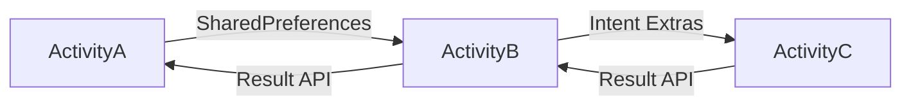

Описание проекта

```markdown
# Activity Navigator

**Проект демонстрирует навигацию между Activity в Android-приложении с передачей данных и управлением стеками задач**

## Ключевые функции
-  Переходы между тремя активностями: A → B → C
- Два способа передачи данных:
  - `SharedPreferences` между A и B
  - `Intent` между B и C
- Возврат данных через цепочку результатов (C → B → A)
- Работа с разными стеками задач:
  - Activity B: `singleInstance`
  - Activity C: новый стек (`taskAffinity`)

## Технологии
- Kotlin
- Android Activity Result API
- SharedPreferences
- Intent с доп. данными (Extras)
- Конфигурация стеков через AndroidManifest

## Архитектура


## Особенности реализации
1. **ActivityA**:
    - Стартовый экран
    - Передача данных в B через SharedPreferences
    - Обработка результата из цепочки B-C

2. **ActivityB**:
    - Запускается в отдельном стеке
    - Посредник между A и C
    - Преобразует результат из C для A

3. **ActivityC**:
    - Создается в новом стеке задач
    - Возвращает данные через Intent

## Проверка работы
1. A → B: Toast с данными из A
2. B → C: Toast с данными из B
3. C → A: Toast с результатом из C
```

